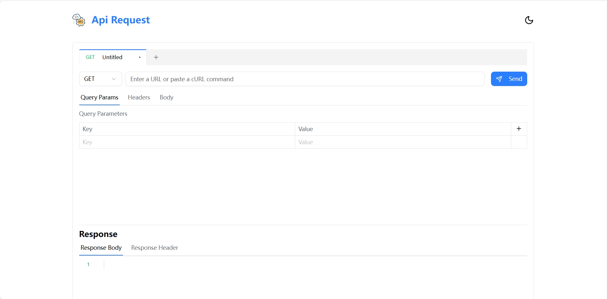

# ⚡ API Request

[](https://api-request-seven-beta.vercel.app)
[](LICENSE)
[](https://github.com/Bill-Tian/api-request/issues)
[](https://github.com/Bill-Tian/api-request/stargazers)

> A clean, fast, and open-source API client — an alternative to Postman and Hoppscotch, built for developers who love minimalism.

🔗 **Live Demo**: [https://api-request-seven-beta.vercel.app](https://api-request-seven-beta.vercel.app)

---

## ✨ Features

- 🧪 Make HTTP requests (GET, POST, PUT, DELETE, etc.)
- 📄 Raw request/response view with status, time, and headers
- 🔁 Support for custom headers and request body (JSON, raw)
- 💾 Request history with local storage
- 🌙 Dark mode / Light mode toggle
- ⚡ Fast, lightweight, and minimal interface

---

## 📸 Screenshots

>  <!-- 可替换为你项目的真实界面图 -->

---

## 💻 Tech Stack

- **Framework**: [Next.js](https://nextjs.org/)
- **Runtime**: [Bun](https://bun.sh/)
- **Styling**: Tailwind CSS
- **Deployment**: [Vercel](https://vercel.com/)
- **State & Hooks**: React, Zustand

---

## 🚀 Getting Started

````bash
# Clone the repo
git clone https://github.com/Bill-Tian/api-request.git
cd api-request

# Install dependencies with pnpm
pnpm install

# Start the development server
pnpm dev


## self-host

```bash
#bun
docker build -t postman -f ./docker/bun/Dockerfile .

#nodejs
docker build -t postman -f ./docker/nodejs/Dockerfile .
````
